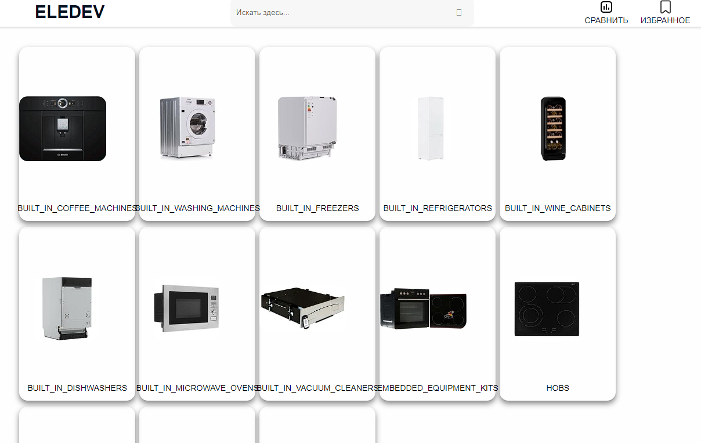

In this project, I tried to recreate the functionality of an online electronics store.
The following features have been implemented:
- View Products
- Browse brands and their products
- Navigation by product categories
- Authorization, registration and exit
- Adding an item to the cart
- Adding a product to the wishlist

- Categories

- Product list

User:

